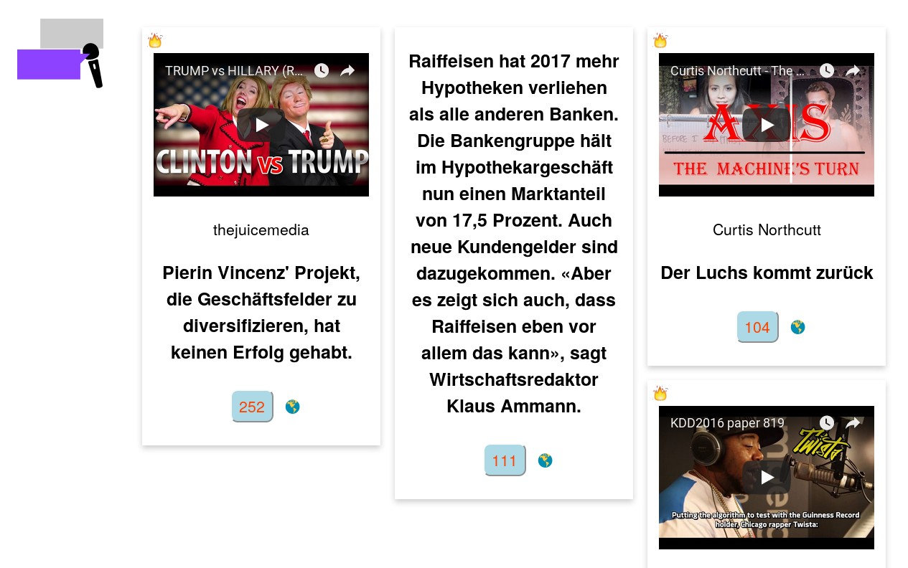

# RapLocal

A community content booster as online arena of opinions: this is a browser extension, database service and frontend created at [SRF hackdays 2018](http://hackdays.ch). See also the companion [browser extension](https://github.com/davidemorotti/raplocal-chrome).

**[Pitch deck](https://speakerdeck.com/twesterhuys/raplocal) ~ [Demo site](http://raplocal.soda.camp) ~ [Chrome plugin](https://github.com/davidemorotti/raplocal-chrome)**



The intent of this project is to generate a rich dataset of user reactions to content on SRF and other websites, that we can mine using machine learning. Our goal is to create an effective, content driven analytics system that is more user facing in than standard web analytics, and might be a way out of the commenting system sackgasse most news websites are in.

Our solution could be integrated directly into the [Escenic CMS](http://www.escenic.com/solutions/extensibility) used on the site, or distributed as an extension in the Chrome and Firefox App Stores.

Richly informative and interactive online stories from SRF Data like the [Roger Federer](https://www.srf.ch/static/srf-data/data/2018/federer/) and [Bandschmieden der Schweiz](https://srfdata.github.io/2017-11-bands/) inspired us to work on this hack. That, and rap music:

<blockquote class="twitter-tweet" data-partner="tweetdeck"><p lang="en" dir="ltr">Fighting fake news with A.I. rap.<br>&quot;Is he rappin&#39;? It&#39;s cool, but fools, just don&#39;t confuse it/<br>What happens: these dudes get rude, then I lose it/<br>I&#39;m scandalous..&quot; –<a href="https://twitter.com/D12?ref_src=twsrc%5Etfw">@D12</a> <a href="https://twitter.com/hashtag/srfhack?src=hash&amp;ref_src=twsrc%5Etfw">#srfhack</a> <a href="https://twitter.com/hashtag/gameon?src=hash&amp;ref_src=twsrc%5Etfw">#gameon</a></p>&mdash; E-0010-9370 (@sodacamper) <a href="https://twitter.com/sodacamper/status/969175132211220480?ref_src=twsrc%5Etfw">March 1, 2018</a></blockquote>

## Research notes

In the design area we are fans of the highlights system at [Medium](https://medium.com/@laurapippinato/highlights) and [Genius](https://en.wikipedia.org/wiki/Genius_%28website%29#Features). However, these systems are not open source, and locked to those sites only. The open source [Annotator](http://annotatorjs.org/)-based [hypothes.is](https://web.hypothes.is/) platform, and its [Hypthesis API](http://h.readthedocs.io/en/latest/api-reference/#operation/search) are a forerunner to this project, and we evaluated as a potential source of seed data. Also past hack projects like [Open Data/Access Button](http://make.opendata.ch/wiki/project:legal:opendatabutton) showed us the potential of this design approach.

For analytics, we initially worked with [Apache Superset](https://superset.incubator.apache.org/) to create a dashboard for the data, but ran into a lot of IT issues. So we switched to [Graphcool](https://www.graph.cool), and started working on using [Google Natural Language API](https://console.cloud.google.com/apis/api/language.googleapis.com/overview?pli=1) and in parallel doing some open source ML in Jupyter notebooks (see `analysis` folder).

We looked at the [video](https://developer.srgssr.ch/apis/rts-archives/videos) and [audio](https://developer.srgssr.ch/apis/srgssr-audio) archive APIs as a potential data source to link to, and tested the [Trending video](https://developer.srgssr.ch/apis/srgssr-video/trending) and [Web content APIs](https://developer.srgssr.ch/apis/rts-webcontent).

[Google Alerts](https://www.google.com/alerts) and it's community [APIs](https://github.com/adasq/google-alerts-api) made us think about using a similar style of notification when new content related to the highlight is produced by the SRF.

# Developer notes

We used the following technologies:

* [Vue](https://vuejs.org/): Progressive Javascript framework for building user interfaces
* [Apollo Client](https://github.com/apollographql/apollo-client): Fully-featured, production ready caching GraphQL client
* [Graphcool](https://www.graph.cool): Flexible backend platform combining GraphQL + AWS Lambda

## Quickstart

### 1. Clone repository

```sh
git clone https://github.com/loleg/raplocal
cd raplocal
```


### 2. Deploy Graphcool service

```sh
# Install Graphcool Framework CLI
npm install -g graphcool
```

Navigate into the `server` directory and [deploy](https://docs-next.graph.cool/reference/graphcool-cli/commands-aiteerae6l#graphcool-deploy) the service:

```sh
cd server
graphcool deploy
```

When prompted which cluster you want to deploy to, choose any. Save the HTTP endpoint for the `Simple API` from the output, you'll need it in the next step.

> **Note**: You can now test your GraphQL API inside a GraphQL playground. Simply type the `graphcool playground` command and start sending queries and mutations.

### 3. Connect the app with your GraphQL API

Paste the `Simple API` endpoint to `./src/main.js` as the `uri` argument in the `createNetworkInterface` call:

```js
// replace `__SIMPLE_API_ENDPOINT__` with the endpoint from the previous step
const networkInterface = createNetworkInterface({ uri: '__SIMPLE_API_ENDPOINT__' })
```

### 6. Install dependencies & run locally

```sh
cd ..
yarn install
yarn start # open http://localhost:3000 in your browser
```

## Next steps

* [Graph.cool Documentation](https://docs-next.graph.cool)
* [vue-apollo-instagram tutorial](https://www.graph.cool/docs/quickstart/)
* [Advanced GraphQL features](https://www.graph.cool/docs/tutorials/advanced-features-eath7duf7d/)
* [Authentication & Permissions](https://www.graph.cool/docs/reference/authorization/overview-iegoo0heez/)
* [Implementing business logic with serverless functions](https://www.graph.cool/docs/reference/functions/overview-boo6uteemo/)
